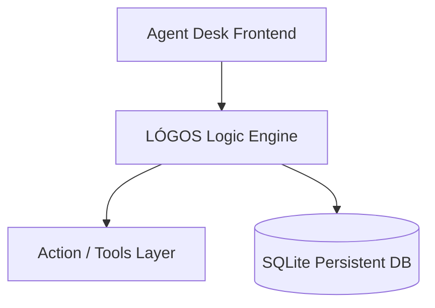

# 🧠 LÓGOS AI


🚀 Run a private local AI system with persistent episodic memory and autonomous tool execution.


## 🎬 Demo


## ⚡ Quick Start

```bash
git clone https://github.com/mosesrb/Logos..git
cd Logos.
npm install
npm run start
```

## ❓ Why LÓGOS?

Most AI tools are cloud-based and have no long-term memory. 

**LÓGOS provides:**
- 100% Local execution
- Persistent episodic memory via SQLite
- Agentic tool execution (browsing, files, DB)

## ✨ Key Features

- **Autonomous Actions**: Agents can write and manage code files independently.
- **Neural Database Management**: Robust memory handling and persona orchestration.
- **Thinking Layer**: Advanced planning logic before action execution.

## 🏗 Architecture



## 📜 License
This project licensed under GPL-v3.
