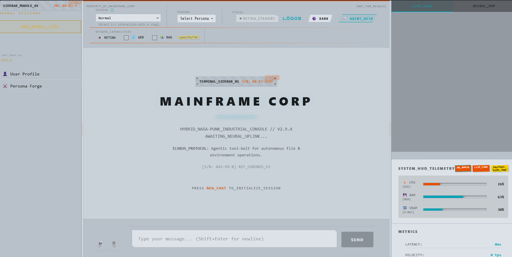

# LÓGOS AI Platform

<div align="center">
  
  <h3>Scalable, Privacy-First Local AI Orchestration Ecosystem</h3>
  
</div>

---

**LÓGOS AI** is a technical framework designed for local execution of Large Language Models (LLMs) with a focus on privacy, stateful memory, and autonomous task delegation. By leveraging local inference, it provides a secure environment for processing personal data, document analysis, and recursive agentic workflows without external API dependencies.

## 🛠️ Core Capabilities

*   **100% Local Execution**: Built on a zero-telemetry architecture. All prompts, conversational history, and episodic memories are stored locally on your hardware.
*   **Agentic Framework (AOD)**: Implements an "Agentic Operations Desk" for dispatching autonomous personas. Supports recursive sub-tasking with a real-time execution trace and tool-calling validation.
*   **Episodic Memory System**: A sophisticated state management layer that preserves long-term conversational context and document relationships, allowing agents to recall specific information from past sessions accurately.
*   **Secure Tool-Calling Protocol**: Integration with local tools including a Python Sandbox, OSINT search, and permissioned filesystem access.
*   **Multi-Modal Pipeline**: Optimized for local ingestion and processing of PDFs, structured documents, and images directly within the local inference loop.
*   **High-Performance UI**: A responsive interface optimized for low-latency interactions, featuring real-time system metrics and modular state overlays.

## 💻 Tech Stack

LÓGOS AI is engineered for modularity and performance:

*   **Inference Engine**: [Ollama](https://ollama.com/) (Managing local Llama 3, Qwen 2, and Gemma 2 weights).
*   **Backend Middleware**: Node.js & Express Service Layer.
*   **State Management**: SQLite (Embedded relational storage for memory and logs).
*   **Frontend Architecture**: React (Vite-powered) with a standardized architectural layout.

---

## 🚀 Installation & Setup

### Prerequisites

1.  **Node.js** (v18+)
2.  **Ollama** installed and accessible via local port 11434.

### Quick Start Guide

1.  **Clone the Repository**
    ```bash
    git clone https://github.com/mosesrb/Logos.git
    cd Logos
    ```

2.  **Run the Setup Utility**
    Launch the initialization script to install dependencies and pre-configure model tiers (Fast, Smart, and Heavy).
    ```cmd
    setup.bat
    ```

3.  **Launch the System**
    Start both the backend orchestration server and the frontend interface:
    ```cmd
    start_logos.bat
    ```

---

## 📜 License & Attribution


**LÓGOS AI** is an open-source project created by **mosesrb (Moses Bharshankar)**.

This project is licensed under the **GNU General Public License v3 (GPL-v3)**. You are free to use, modify, and distribute the software, provided that all derivatives remain open-source under the same license terms.
