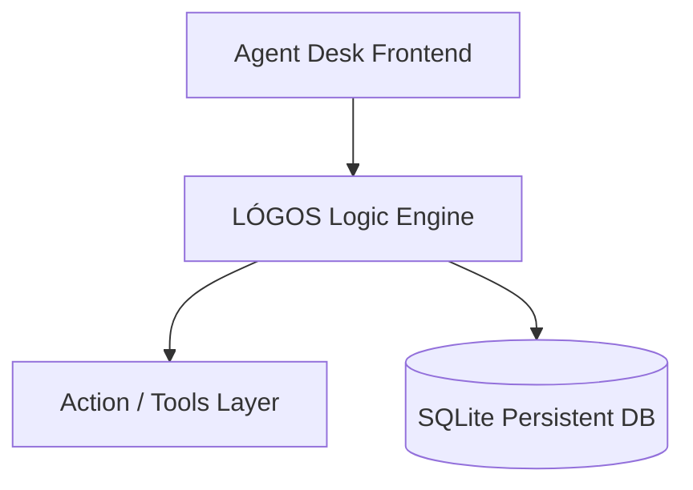

# 🧠 LÓGOS AI


**LÓGOS AI** is a sovereign, local-first command center for artificial intelligence. It bridges the gap between disconnected local models (LLMs, Image Gen, TTS) and creates a unified, agentic system with persistent episodic memory.

Built for those who refuse to trade privacy for utility, LÓGOS ensures that your "thinking partner" lives entirely on your hardware, under your control.

---

## 🎬 Beyond Simple Chat

Standard AI chats are stateless and forget you as soon as the session ends. **LÓGOS is different.**

**The Workflow:**
1. **User**: "Analyze my recent code changes and generate a progress image for the dev blog."
2. **LÓGOS (Thinking)**: 
   - Executes File Tool to read the workspace.
   - Summarizes changes using a local Ollama model.
   - Orchestrates a ComfyUI prompt to generate the visual.
   - Stores the context in the **Memory Palace (SQLite)** for future reference.

## 🎬 How it Looks


---

## ⚡ The Quick Start

```bash
git clone https://github.com/mosesrb/Logos.git
cd Logos
npm install      # Installs the agentic backend
npm run start    # Launches the local command center
```

---

## 🛠️ Unified Orchestration

LÓGOS isn't just a frontend; it's a multi-modal orchestrator.



### 🏛️ The Memory Palace (SQLite)
Privacy doesn't have to mean amnesia. LÓGOS uses an isolated **SQLite persistence layer** to track:
- **Episodic Memory**: Specific details about past conversations and tasks.
- **Persona Context**: Dynamic switching between developer, writer, and analyst roles with persistent behavioral history.
- **Local Sovereignty**: This database never leaves your machine, providing a "long-term memory" that is 100% private.

### 🧩 Agentic Tool Execution
The system implements a robust **Tool/Action Layer**. It doesn't just talk about doing things; it performs them:
- **Filesystem Access**: Read, write, and audit local code.
- **Image Synthesis**: Driven by a direct bridge to **ComfyUI**.
- **Local LLM**: Powered by **Ollama**, allowing for swappable models (Llama 3, Mistral, Phi-3).

### 🧠 The Thinking Layer
Inspired by advanced reasoning agents, LÓGOS includes a forced **Planning Phase**. Before executing any tool, the agent must articulate its "Chain of Thought," decomposing complex requests into atomic, verifiable steps. This drastically reduces hallucinations and ensures logical consistency in complex workflows.

---

## ✨ Key Features

- **Multi-Modal Streaming**: True real-time interaction for both text and generated assets.
- **Sovereign Persona Management**: Design and refine AI agents that evolve based on your interaction history.
- **Zero Telemetry**: No tracking, no data leakage, no "calling home."

## 🛡️ Privacy First

Everything you see is local. The models run on your GPU. The memory sits on your SSD. The logic belongs to you.

---

*Because intelligence should be private.*
