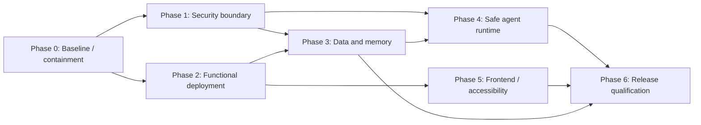

# LÓGOS AI — Phase-Wise Remediation Plan

**Source:** [Production-Readiness Audit](logos_audit_report.md)  
**Objective:** Bring LÓGOS AI from an audit score of 2.8/10 to a defensible, local-first public-beta candidate without treating UI hiding or documentation changes as security fixes.  
**Planning rule:** No feature expansion, remote access, plugin system, browser use, cloud synchronization, or multi-agent work begins until the security and integrity gates below pass.

## Delivery model

| Phase | Target duration | Outcome | Exit gate |
| --- | ---: | --- | --- |
| 0 — Baseline and containment | 2–3 days | Reproducible, non-exposed development baseline | Clean install/build/test command works; dangerous public routes are disabled |
| 1 — Security boundary | 1 sprint | No unauthenticated code execution or generic data administration | Threat-model and API security tests pass |
| 2 — Functional deployment core | 1 sprint | Controllers, preview, and Docker routes work as designed | Route and Compose integration tests pass |
| 3 — Data and memory foundation | 2 sprints | One authoritative, recoverable persistence model | Migration, backup/restore, and consistency tests pass |
| 4 — Safe agent and workload runtime | 2 sprints | Agent actions are approved, isolated, bounded jobs | Capability, sandbox, cancellation, and abuse tests pass |
| 5 — Frontend and accessibility hardening | 1–2 sprints | Maintainable, responsive, accessible operations UI | Browser, mobile, keyboard, and axe acceptance tests pass |
| 6 — Release qualification | 1 sprint | Repeatable public-beta evidence | CI, security review, performance targets, and release checklist pass |

Durations assume one focused product team and can overlap only where the dependency graph permits it. Phase 3 must finish before memory features are expanded; Phase 4 must finish before agentic automation is re-enabled.

## Implementation status — 2026-07-18

| Phase | Status | Completed in this workspace |
| --- | --- | --- |
| 0 — Baseline and containment | Complete | Runtime-data exclusions, `.env.example`, default-disabled dangerous APIs, origin restrictions, bounded RAG uploads, safe session scopes, and shell-free syntax validation |
| 1 — Security boundary | In progress | Default-deny flags now cover agent dispatch, generic DB administration, ComfyUI process launch, and destructive memory administration; full authentication/authorization is still required |
| 2–4, 6 | Not started | Pending the Phase 1 authorization design and a single authoritative persistence model |
| 5 — Frontend and accessibility | In progress | Error boundary, visible focus indicators, reduced-motion support, keyboard image expansion, Escape-to-close dialogs, labelled chat controls, and disabled-admin UI feedback |

## Phase 0 — Baseline and containment

**Purpose:** Establish a trustworthy development/release baseline without exposing unsafe behavior.

### Work items

1. Freeze new feature work and tag the audited state for comparison.
2. Repair the Node/npm toolchain, then document and verify one clean-install command per supported platform.
3. Create `.env.example` with only non-secret placeholders; validate required environment variables at startup.
4. Replace the minimal `.gitignore` with exclusions for `.env`, SQLite database/WAL/SHM files, chats, uploads, output, caches, logs, temporary OCR files, generated/scratch files, and model runtime data.
5. Remove runtime/test artifacts and personal data from the distributable source tree through a reviewed, recoverable cleanup process.
6. Disable in production builds: `/api/tools/execute`, `executeCommand`, `python_exec`, generic database CRUD endpoints, ComfyUI launch, and destructive memory/session operations. A UI toggle is not sufficient; routes and tool registration must be unavailable server-side.
7. Define deployment modes: `desktop-local` (loopback only) and a future `networked` mode (disabled until Phase 1).
8. Normalize repository and documentation text to UTF-8 and reconcile claimed version/status with tested functionality.

### Issues addressed

| Audit issue | Phase-0 treatment |
| --- | --- |
| C-01 | Remove/disable public execution paths pending a safe replacement |
| C-02 | Remove/disable generic DB console pending domain APIs |
| H-05 | Default to loopback-only and eliminate exposed high-risk routes |
| M-03 | Repair npm and create a reproducible test/build baseline |
| M-04 | Clean runtime data, paths, environment configuration, and repository hygiene |
| 11–13 | Establish code-quality, DevOps, and testing baseline |

### Exit criteria

- A clean clone can install dependencies using lockfiles and run syntax, unit, build, and smoke commands.
- A production-mode route inventory proves disabled routes return 404/405 and unavailable tools cannot be selected by a client or model.
- No secrets, chats, uploads, databases, generated files, or host-specific paths are tracked in the release tree.
- The application starts with a documented configuration error when required settings are absent.

## Phase 1 — Security boundary

**Purpose:** Replace the assumption of trusted local callers with enforceable protection.

### Work items

1. Write and approve a threat model covering desktop users, local malicious processes, hostile prompts/documents, LAN deployment, artifact preview, and optional future internet access.
2. Introduce authentication and role-based authorization for every mutable or sensitive route in networked mode. Keep desktop-local bound to loopback with an explicit startup assertion.
3. Implement server-owned permissions. The request body, persona, and model must never decide which privileged tools are available.
4. Replace unrestricted `cors()` with an explicit origin/method/header allowlist. Add security headers, CSP, request IDs, structured/redacted logs, and appropriate CSRF protection if cookie authentication is used.
5. Delete the generic SQL administration API from production. Implement narrowly scoped, authenticated domain operations for sessions, personas, settings, and memory.
6. Add schema validation at every API boundary using a common validator. Allowlist all SQL identifiers in any development-only diagnostic feature.
7. Add per-route rate limits, request-body limits, file-count limits, and safe error responses. Upgrade Multer and reject/clean up unsupported uploads before parsing.
8. Define a fail-fast process policy with a supervisor/restart strategy; do not continue after unknown uncaught exceptions.

### Issues addressed

| Audit issue | Phase-1 permanent remediation |
| --- | --- |
| C-01 | Server-owned deny-by-default tool policy; no arbitrary shell or Python capability |
| C-02 | Remove generic CRUD; validate/allowlist any identifiers in development-only diagnostics |
| H-05 | Authentication, authorization, CORS/CSRF/headers, rate limiting, safe logging |
| H-06 | Upload/input limits and Multer upgrade |
| 7 | Filesystem, injection, CORS, authentication, and secret-handling controls |
| 17 | Host compromise and exposed-control-plane risks reduced |

### Exit criteria

- Security integration tests prove unauthenticated callers cannot read, modify, delete, dispatch tools, launch processes, or administer data.
- Negative tests cover path traversal, SQL identifier injection, CORS, oversized/invalid uploads, prompt-triggered tool use, and rate limits.
- A documented threat model has owners and residual-risk acceptance for desktop-local mode.

## Phase 2 — Functional deployment core

**Purpose:** Make the documented product paths function correctly with explicit boundaries.

### Work items

1. Replace the loose controller `context` object with a typed/validated dependency contract. Pass every required dependency explicitly, including upload/output roots and memory services.
2. Add route integration tests that execute every mounted route at least once and fail on unresolved dependencies.
3. Centralize filesystem path handling. Use a root-bound resolver based on `path.relative`; reject absolute paths, traversal, sibling-prefix matches, and symlink escapes.
4. Create a dedicated artifact-serving service. Serve previewable artifacts from a separate origin or sandbox with restrictive CSP, `nosniff`, safe content-disposition, extension allowlists, retention cleanup, and per-session authorization.
5. Add iframe sandbox permissions incrementally from zero. Never allow generated HTML to inherit the application’s API origin.
6. Make API location configurable. In Docker bind backend service traffic correctly, configure Nginx `/api` proxying to `backend:3008`, and align Vite development proxy with the same contract.
7. Add Docker health checks, readiness checks for required local services, and a Compose end-to-end smoke test.

### Issues addressed

| Audit issue | Phase-2 remediation |
| --- | --- |
| H-01 | Complete dependency injection and safe, tested path resolver |
| H-02 | Functioning, isolated artifact-serving and preview pipeline |
| H-03 | One environment-driven frontend/backend API contract and verified Docker routing |
| H-05 | Safe error and route behavior reinforced through integration testing |
| 1–3, 10, 12 | Module boundaries, backend routes, UI preview, and deployment correctness |

### Exit criteria

- Every controller dependency is resolved by construction and exercised by integration tests.
- Valid session artifacts preview successfully; malicious HTML/JS cannot access the main application origin or API.
- `docker compose up` exposes a functioning frontend-to-backend chat/API path without hard-coded host addresses.
- Path-traversal and symlink-escape tests pass across all file endpoints.

## Phase 3 — Data and Memory Foundation

**Purpose:** Replace conflicting stores with a durable, explainable Memory Palace.

### Work items

1. Make an architectural decision record selecting SQLite as the authoritative transactional store. Define whether Chroma/MemPalace is a derived index and how it is rebuilt.
2. Introduce versioned migrations with a migration ledger, startup migration policy, rollback/forward recovery guidance, and explicit `PRAGMA foreign_keys = ON` verification.
3. Migrate JSON runtime state to repositories over SQLite. Retain JSON only for supported import/export and create a one-time, idempotent migration path.
4. Replace fire-and-forget dual writes with transactions plus an outbox/reconciliation process for derived indexes.
5. Align the relationships schema with session/persona ownership and add appropriate indexes for message history, chronological retrieval, ownership, and cleanup.
6. Implement encrypted-at-rest option or documented OS-level protection, atomic backups, restoration drills, retention schedules, export/delete requests, and corruption recovery procedures.
7. Define memory records with source, owner, consent, creation time, confidence, scope, expiry, and deletion propagation.
8. Implement deterministic filtering plus tested hybrid retrieval. Keep retrieved web/RAG/user content labelled as untrusted data, bounded by token budgets, and isolated from tool/system instructions.
9. Add memory deduplication, pruning, user review, evaluation datasets, and regression tests for recall quality and prompt-injection resistance.

### Issues addressed

| Audit issue | Phase-3 remediation |
| --- | --- |
| H-04 | Single source of truth, migrations, transactions, backups, and index reconciliation |
| M-01 | Provenance, ranking, pruning, trust isolation, and memory evaluation |
| C-02 | Domain persistence APIs preserve invariants rather than exposing raw tables |
| 4–5, 8–9, 14 | Database, Memory Palace, AI context, performance, and scale foundations |

### Exit criteria

- Fresh install, upgrade migration, import, backup, restore, and crash-recovery tests pass.
- A consistency test proves sessions, messages, personas, relationships, visual data, and derived vector indexes converge after write, delete, and restore.
- Retrieval tests show sources, ownership, bounded context, deletion propagation, and no instruction elevation from untrusted documents.
- No runtime feature relies on a writable JSON store as its authority.

## Phase 4 — Safe Agent and Workload Runtime

**Purpose:** Reintroduce useful automation without reintroducing remote-code-execution risk.

### Work items

1. Define a versioned tool manifest: name, typed input/output schema, read/write side effects, required user approval, allowed execution environment, timeout, quota, audit data, and failure mode.
2. Implement a deny-by-default capability service. A session receives only the least privilege approved by the user; the model cannot expand it.
3. Replace shell execution with specific operations (read approved workspace file, create a restricted artifact, inspect selected project metadata). Do not provide a generic command or Python tool.
4. Run any unavoidable generated-code execution in a disposable, unprivileged sandbox with a read-only base image, ephemeral session directory, no host credentials, network disabled by default, resource limits, and output capture.
5. Use a durable job queue for Ollama, ComfyUI, OCR, document parsing, and sandbox tasks. Add cancellation propagation, concurrency limits, queue visibility, retry classification, and retention cleanup.
6. Harden prompt construction: distinguish instructions from retrieved content, reject unauthorized tool calls, validate every tool argument, and require confirmation for file writes, model unloading, memory deletion, and other irreversible actions.
7. Add an agent audit trail that records identity, user approval, requested capability, normalized arguments, result, timing, and error without storing secrets unnecessarily.
8. Create adversarial test fixtures for malformed JSON/tool output, Markdown code blocks, document prompt injection, runaway loops, disconnects, and resource exhaustion.

### Issues addressed

| Audit issue | Phase-4 remediation |
| --- | --- |
| C-01 | Safe replacement for executable tools and prompt-controlled authority |
| H-06 | Bounded queue, quotas, cancellation, and worker isolation |
| M-01 | Trusted prompt/context assembly and injection resistance |
| 6, 8–9, 14, 16 | Agent framework, AI pipeline, performance, scalability, and deferred features |

### Exit criteria

- No API path, agent output, or malformed tool call can execute arbitrary host commands.
- Side-effecting actions show a user approval record and run only with the approved capability.
- Sandbox escape, network-blocking, timeout, cancellation, and quota tests pass.
- Job dashboard/API reports queue state and allows safe cancellation; no abandoned job leaks resources.

## Phase 5 — Frontend and Accessibility Hardening

**Purpose:** Make the operations UI maintainable, understandable, and usable across supported devices.

### Work items

1. Finish extraction of chat transport, session state, memory actions, and layout state from `App.jsx` into tested feature hooks/services. Remove `App.backup.jsx` and source-tree mutation scripts after preserving necessary history in Git.
2. Centralize API client configuration, errors, retries, cancellation, and SSE lifecycle management. Add an error boundary and explicit offline/reconnect/timeout UI states.
3. Replace clickable non-semantic elements with semantic controls; add accessible names for icon buttons, keyboard equivalents, visible focus states, escape/enter behavior, and focus traps/restoration for dialogs.
4. Verify contrast, font scaling, reduced motion, screen-reader announcements for streaming/errors, and status semantics for tool actions.
5. Convert key administration/memory views to responsive card layouts and test touch targets, viewport resizing, slow inference, empty state, destructive confirmations, and permission explanations.
6. Clearly distinguish model text, external/retrieved text, proposed tool actions, approved actions, and completed changes in the UI.
7. Add component tests and browser tests for the main chat, session/file flows, preview, agent approval, themes, desktop/tablet/mobile layouts, and accessibility.

### Issues addressed

| Audit issue | Phase-5 remediation |
| --- | --- |
| M-02 | Remove monolith/duplicates; accessibility, responsive design, test coverage |
| H-02 | Safe-preview experience and user-visible isolation status |
| H-05 | Clear permission and destructive-action UX |
| 3, 10–11, 13 | Frontend, UX, code quality, and testing concerns |

### Exit criteria

- App state is split into cohesive tested modules, with no duplicate production app implementation.
- Keyboard-only critical flows and modal behavior pass manual acceptance tests.
- Automated axe checks pass with no serious/critical violations on core screens.
- Supported desktop, tablet, and Android viewport tests pass for normal, loading, error, empty, streaming, and destructive states.

## Phase 6 — Release Qualification

**Purpose:** Produce measurable evidence that the beta is secure, operational, and maintainable.

### Work items

1. Build CI gates for lockfile install, formatting/linting, unit tests, API integration tests, browser E2E tests, accessibility checks, migration/backup restore tests, container smoke tests, and dependency/SBOM scanning.
2. Set baseline performance budgets: startup time, initial UI response, SSE latency, long-session load, memory retrieval latency, upload parsing, queue wait time, and GPU job concurrency. Test with large sessions and supported hardware tiers.
3. Run a focused security assessment of authentication, capability boundaries, artifact isolation, file handling, data deletion, and the networked mode before it is enabled.
4. Publish supported platform matrix, operational runbook, privacy/data-retention notice, backup/restore instructions, incident/update procedure, and release notes.
5. Perform a beta readiness review against the exit criteria below; unresolved High/Critical findings require explicit risk acceptance and must not be labelled production-ready.

### Issues addressed

| Audit issue | Phase-6 remediation |
| --- | --- |
| M-03 | Continuous test, build, security, and release evidence |
| M-04 | Operational documentation, release hygiene, supported configuration |
| All audit sections | Independent verification and readiness sign-off |

### Exit criteria

- CI is green from a clean environment and blocks release on security, build, test, migration, or container-smoke failure.
- Performance budgets are documented and met on supported hardware; overload behavior is graceful and observable.
- Security review confirms C-01 and C-02 remain absent, preview is isolated, and networked mode has authenticated access.
- The release bundle contains no personal/runtime data, secrets, unsupported host paths, or development-only administration tools.

## Phase 5 implementation completion (2026-07-18)

Phase 5 implementation work is complete for the current local-first product scope. The application now has an error boundary, visible focus styles, reduced-motion support, semantic and labelled critical controls, keyboard image expansion, Escape-to-close dialogs, status announcements, and disabled-admin feedback. Optional workspaces are code-split, reducing the initial production JavaScript from approximately 579 kB to 517 kB. The prior unused backup, broken chat-extraction hook, and source-tree mutation scripts were removed so `App.jsx` is the single maintained runtime implementation.

Verification: the production build passes. The browser automation environment could not reach the isolated local development server, so in-browser/axe checks remain a release-qualification gate rather than a claim of completed runtime verification.

## Issue-to-phase traceability

| Audit issue | Contain | Permanent remediation | Verify |
| --- | --- | --- | --- |
| C-01 — Arbitrary command/Python execution | 0 | 1 and 4 | 4 and 6 |
| C-02 — SQL injection/generic DB administration | 0 | 1 and 3 | 1, 3, and 6 |
| H-01 — Missing controller dependencies/path safety | 0 | 2 | 2 and 6 |
| H-02 — Broken/unsafe preview | 0 | 2 and 5 | 2, 5, and 6 |
| H-03 — Docker/API mismatch | 0 | 2 | 2 and 6 |
| H-04 — Multiple persistence authorities | 0 | 3 | 3 and 6 |
| H-05 — Missing security baseline | 0 | 1 | 1 and 6 |
| H-06 — Unbounded uploads/workloads | 0 and 1 | 4 | 4 and 6 |
| M-01 — Weak memory retrieval/provenance | 0 | 3 and 4 | 3, 4, and 6 |
| M-02 — Frontend monolith/accessibility | 0 | 5 | 5 and 6 |
| M-03 — Insufficient testing/release engineering | 0 | 6 | 6 |
| M-04 — Repository/operational hygiene | 0 | 6 | 0 and 6 |

## Public-beta go/no-go checklist

Public beta is **go** only when all statements below are true:

- No Critical or High audit finding is open, unless a documented exception is approved by the accountable owner and does not expose user data or host execution.
- Any route capable of changing files, memories, models, or settings has authentication/authorization in networked mode and an auditable approval boundary.
- Generic command execution and generic DB administration are absent from the distributed product.
- Persistence is recoverable from backup and consistent after crashes, migration, deletion, and derived-index rebuild.
- Generated content is previewed in an isolated origin/sandbox and cannot call privileged APIs.
- Builds, tests, security scans, and Docker smoke tests run in CI from a clean checkout.
- Core desktop/mobile/keyboard/accessibility workflows are accepted on the documented support matrix.

## Sequencing constraints

Do not shortcut the ordering by re-enabling agent tools after Phase 1: their safe replacement depends on the data boundaries from Phase 3 and the workload isolation from Phase 4.
